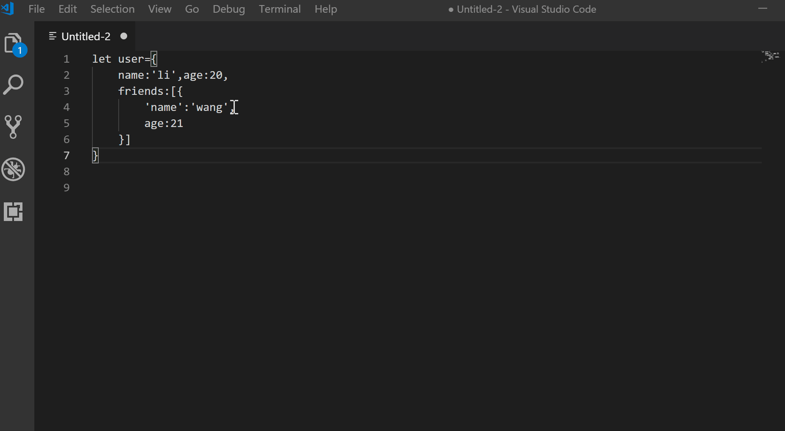

# prettyJson README

## Usage

press `F1` or `Ctrl+Shift+P` and run the Command `"prettyJson"`


## Setting

press `ctrl+,` ,you will see User and Workspace setting. Workspace setting will override User setting.

open Extensions->Pretty-Json ,you will see three settings

- Detect Indentation
- Indent Width
- Use Tabs

1. Detect Indentation > Use Tabs.
2. Indent Width indications the number of space when use space.

## Main Features

The prettier or vscode-json beautify can format pretty json,but they don't format javascript object,such as

```js
{
  name: 1;
}
```

The prettyJson is more power than vscode-json beautify.PrettyJson can format pretty any javascript object.

```js
{name:"li"}
=>
{
    "name":"li"
}

{'name':'li'}
=>
{
    "name":"li"
}
```

remove comment

```js
[{
    name:'li',//this is a comment
    age:2
}]
=>
[
    {
        "name": "li",
        "age": 2
    }
]
```

The prettyJson is more power than prettier when format pretty json,it support pretty partial code in any file.
